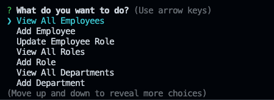
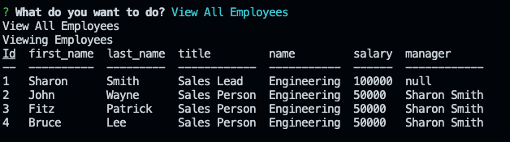

# Employee-Management
## Table of contents
​
- [Overview](#overview)
  - [The challenge](#the-challenge)
  - [User Story](#user-story)
  - [Acceptance Criteria](#acceptance-criteria)
  - [Screenshot](#screenshot)
  - [Links](#links)
- [My process](#my-process)
  - [Built with](#built-with)
  - [What I learned](#what-i-learned)
  - [Continued development](#continued-development)
  - [Useful resources](#useful-resources)
- [Author](#author)

## Overview
​
### The challenge
​
Build a command-line application from scratch to manage a company's employee database, using Node.js, Inquirer, and MySQL.
​
### User Story
​
AS A business owner
I WANT to be able to view and manage the departments, roles, and employees in my company
SO THAT I can organize and plan my business
​
### Acceptance Criteria

GIVEN a command-line application that accepts user input
WHEN I start the application
THEN I am presented with the following options: view all departments, view all roles, view all employees, add a department, add a role, add an employee, and update an employee role
WHEN I choose to view all departments
THEN I am presented with a formatted table showing department names and department ids
WHEN I choose to view all roles
THEN I am presented with the job title, role id, the department that role belongs to, and the salary for that role
WHEN I choose to view all employees
THEN I am presented with a formatted table showing employee data, including employee ids, first names, last names, job titles, departments, salaries, and managers that the employees report to
WHEN I choose to add a department
THEN I am prompted to enter the name of the department and that department is added to the database
WHEN I choose to add a role
THEN I am prompted to enter the name, salary, and department for the role and that role is added to the database
WHEN I choose to add an employee
THEN I am prompted to enter the employee’s first name, last name, role, and manager, and that employee is added to the database
WHEN I choose to update an employee role
THEN I am prompted to select an employee to update and their new role and this information is updated in the database
​
### Screenshot
​

​
​
### Links
​
- Solution URL: [Github](https://github.com/VendettiStudios/Manage-Employees)
​
## My process
​
### Built with
​
- MYSQL
- INQUIRER
- NODE.JS
- JAVASCRIPT
### How to start
- npm init -y
- npm i inquirer mysql2 (console.table isn't necessary, prints rows without)
- Make sure databases are created and seeded, Use <source (folder/file)>
​
### What I learned
​
I learned about Inquirer native esm modules vs commonjs modules, and the differences, I went with an earlier version.
I also learned that if you have index.js instead of server.js the "start script" will not automatically install to package.json.

USE npm install --save inquirer@^8.0.0, npm I inquirer will not work because the new version requires "Import statements" vs's "require statements".

### Continued development
​
Adding Delete functions, More Editing functions, showing results after Adding to database in tables

​
### Useful resources
​
- [Resource 1](https://www.npmjs.com/package/inquirer#issues -
​

## Author
​
- [Daniel Holloway](https//:Danielholloway.dev)

​
